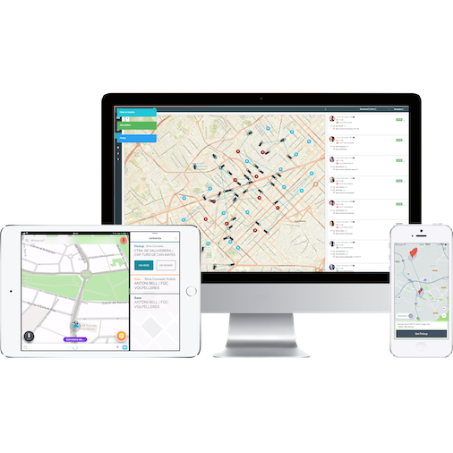

Shotl MaaS API allows integrating demand-responsive transport services provided by Shotl with a third party platform 
offering multi-modal mobility, as a MaaS operator or a journey planner.

Mirroring the functions of the Shotl App for passengers available in iOS and Android markets, it permits to estimate 
times and book rides within any of the areas where Shotl is currently offering transportation.

